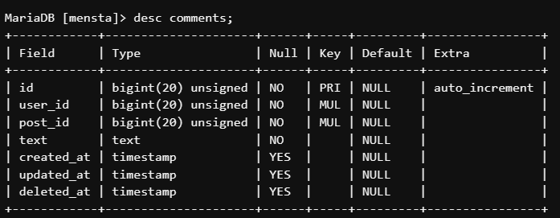

# 麺stagram
## 制作背景
このアプリは大学のサークルの活動を基に作成を行いました。
サークルでは食べたラーメンの写真と文章をライングループのノート機能を使って共有するという活動を行っていました。
その活動をもっと活発に行いたい、多くの人とおいしいラーメンの情報を共有したいと思いこのアプリをつくりました。
## 概要
ラーメンの写真、文章（感想）、お店の位置情報の投稿、閲覧が基本機能です。
位置情報は店名から検索して登録します。
閲覧ではタグやユーザー、投稿のキーワード検索が可能です。
今いる位置から行きたいラーメン屋さんを探しやすくするために投稿にお店の情報機能をつけました。
ラーメン屋さんの情報をたくさんシェアしてほしいです！
## 開発環境
**使用言語：**
- PHP
- Blade
- CSS
- JavaScript

**環境：**
- Laravel(ver.9)
- AWS(EC2＋Cloud9)
- MySQL(MariaDB)
- Cloudinary
- Github

__API：__
- Google Places API
- Google Maps JavaScript API

**デプロイ：**
- Heroku
## データ構造
**テーブル構成・リレーション:**

**各テーブル詳細：**

## 機能
- ログイン
- 文章・画像投稿
- 投稿検索
- タグ
- GoogleマップAPIによる地図表示とマーカー
- 投稿に対するいいね
- 投稿に対するコメント
## 今後の計画
- UIを整える、見やすいように工夫する
- 人気のタグを表示
- 自分が今いる位置を地図に表示
- SNSと連携し投稿のシェアをできるようにする

